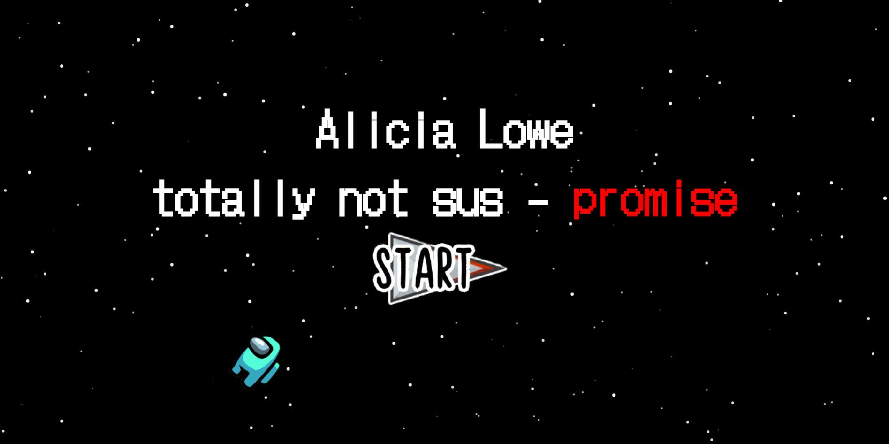
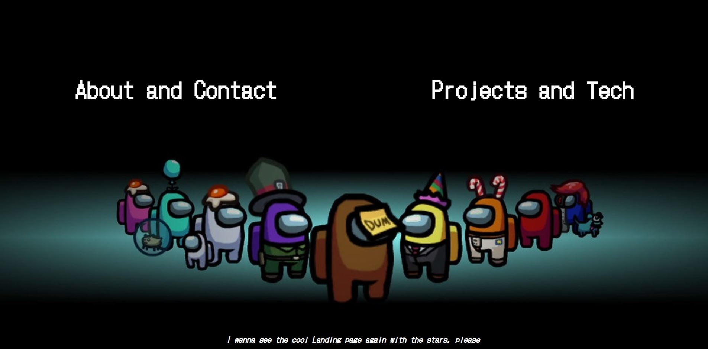
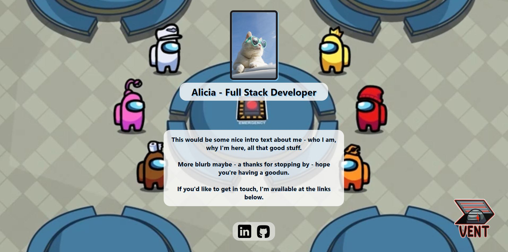
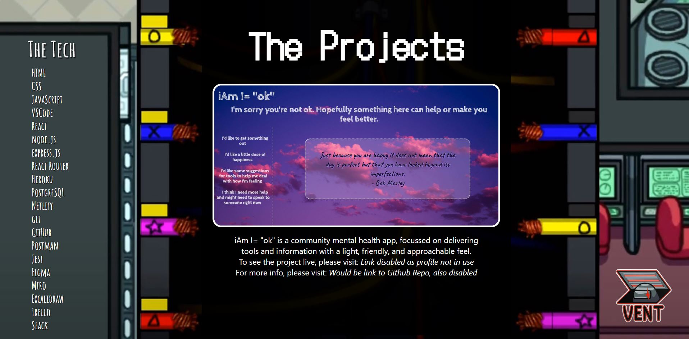

# Among Us Portfolio Project

## Screenshots

Landing page:

Options page:

About and Contact page:

Projects and Tech page:

## The Project

This was actually a happy accident as I didn't set out to create this, but was planning to use tsparticles for a different design I had in mind. However, the minute I found the Among Us version of tsparticles, I was just inspired to play with it and have some fun, and decided to spin up a portfoilo design!

## Some Thoughts

One of the reasons I wouldn't carry this through as my main portfolio (aside from maybe the argument it's not very professional) is that the backgrounds would be very hard to work with for mobile design because they're landscape, and the design relies heavily on the background images to carry through the theme.

Finding similar fonts to those used in the game was quite fun using Google fonts, and I think this worked well to re-create the Among Us feel.

Applying tsparticles wasn't as simple as the docs suggested, nor the tutorials I'd seen, and took some bodging of various things - so I'd just be aware of this for anyone considering implementing it. Don't let that put you off, but likewise don't beat yourself up if you've done everything as told and it still won't work! Once you get it working there are a lot of places you can modify things to get it how you want; for example, on this profile I slowed down the animation of the stars, as well as the movement and colour of the character.

Sadly there is no brown (which I usually play) :disappointed:

I found that making buttons with transparent backgrounds is very difficult without paid software; the one free solution I found that worked added a large background border around the image that couldn't be removed, and that obviously made it unsuitable for a button because of the size of the clickable area.

## But...

For all the challenges when it came to making it look just right, I still love this portfolio design :blush:

### NB. I've removed/disabled links incase people fork this repo :smile:
